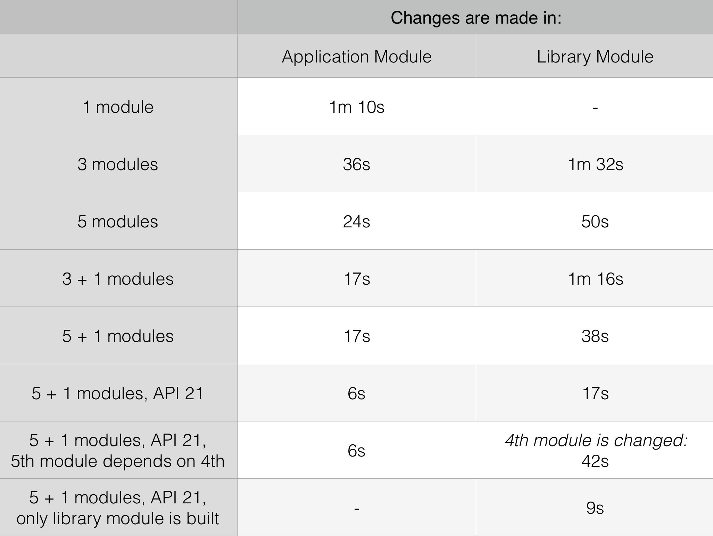

# GradleBuildExperiment. Single module configuration without Annotation Processors.
Android experiment that clarify dependency between amount of modules and incremental build time.
You can find more details and results of this experiment [here](https://medium.com/@nikita.kozlov/how-modularisation-affects-build-time-of-an-android-application-43a984ce9968#.c4ty1onb1)
.

### Problem
If in a single-module project one class is changed, gradle have to recompile the whole project.

### Hypothesis
Incremental build for a project with multiple modules is faster then for a single-module project, because only modified modules are recompiled while the rest — not.

### Structure
Every branch will have it's own configuration. All configurations has around 90 000 methods splitted among 15 000 classes.
Configurations are listed roughly in order they mentioned in the article.
* [1 module](https://github.com/NikitaKozlov/GradleBuildExperiment/tree/1module). Initial state.
* [3 modules](https://github.com/NikitaKozlov/GradleBuildExperiment/tree/3modules). Code is equally split between 3 modules.
* [3 modules release conf](https://github.com/NikitaKozlov/GradleBuildExperiment/tree/3modules_releaseconf). Code is equally split between 3 modules. But both debug and release versions of application depends on release versions of library modules.
* [5 modules](https://github.com/NikitaKozlov/GradleBuildExperiment/tree/5modules). Code is equally split between 5 modules.
* [3 + 1 modules](https://github.com/NikitaKozlov/GradleBuildExperiment/tree/3+1modules). Code is equally split between 3 library modules. Application module is tiny.
* [5 + 1 modules](https://github.com/NikitaKozlov/GradleBuildExperiment/tree/5+1modules). Code is equally split between 5 library modules. Application module is tiny.
* [1 module without Annotation processors](https://github.com/NikitaKozlov/GradleBuildExperiment/tree/1module-apt). The only configuration without Annotation Processors.
* [1 module API 21](https://github.com/NikitaKozlov/GradleBuildExperiment/tree/1module_api21). Like initial state, but `minSdk` is 21.
* [5 + 1 modules API 21](https://github.com/NikitaKozlov/GradleBuildExperiment/tree/5%2B1modules_api21). Exactly like *5 + 1* configuration, but `minSdk` is 21.

### Results
Below you can find final results for incremental build time. For best case it was reduced from *1m 10s* to *17s*. For more explanation please read [the article](https://medium.com/@nikita.kozlov/how-modularisation-affects-build-time-of-an-android-application-43a984ce9968#.c4ty1onb1)
.

